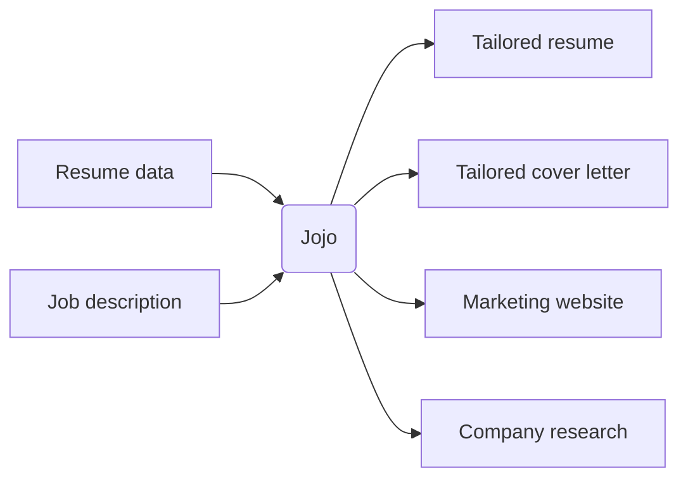

# JoJo - Job Search Support System


[](https://github.com/grymoire7/jojo/blob/main/LICENSE.txt)

A Ruby CLI that transforms job applications into comprehensive, personalized marketing campaigns. Instead of sending a generic resume and cover letter, Jojo generates tailored materials for each opportunity: a customized resume, persuasive cover letter, company research, and a professional landing page — all powered by AI.



**[Read the technical blog post](https://tracyatteberry.com/posts/jojo)** about building this tool with Claude AI assistance.

## Documentation

Full documentation is available at the **[Jojo documentation site](https://grymoire7.github.io/jojo/)**, including:

- [Getting Started](https://grymoire7.github.io/jojo/getting-started/installation) — Installation, configuration, and quick start
- [Commands](https://grymoire7.github.io/jojo/commands/) — All available commands with usage and examples
- [Guides](https://grymoire7.github.io/jojo/guides/first-application) — Step-by-step walkthroughs
- [Architecture](https://grymoire7.github.io/jojo/architecture/overview) — System design and key decisions
- [Examples](https://grymoire7.github.io/jojo/examples/configuration) — Annotated configuration files

## Quick install

```bash
git clone https://github.com/grymoire7/jojo.git
cd jojo
bundle install
./bin/jojo setup
```

The setup wizard guides you through provider selection, API key configuration, and model selection. Then customize `inputs/resume_data.yml` with your experience and run:

```bash
./bin/jojo new -s company-role -j job_description.txt
./bin/jojo generate -s company-role
```

See the [quick start guide](https://grymoire7.github.io/jojo/getting-started/quick-start) for the full walkthrough.

## Development

```bash
./bin/test                        # Run all tests (standard + unit + integration)
bundle exec rake test:unit        # Unit tests only
bundle exec rake test:integration # Integration tests only
bundle exec standardrb            # Code style checks
./bin/coverage_summary             # Text coverage summary
```

This project uses [Standard Ruby](https://github.com/standardrb/standard) for formatting and [Conventional Commits](https://www.conventionalcommits.org/) for commit messages.

## Contributing

This is a personal project, but if you'd like to contribute:

1. Fork the repository
2. Create a feature branch
3. Make your changes with tests
4. Run `./bin/test` to verify
5. Submit a pull request

## Credits

Created by [Tracy Atteberry](https://tracyatteberry.com) using:
- [Ruby](https://www.ruby-lang.org/) — Programming language
- [Thor](https://github.com/rails/thor) — CLI framework
- [RubyLLM](https://github.com/crmne/ruby_llm) — AI service integration
- [html-to-markdown](https://github.com/kreuzberg-dev/html-to-markdown) — Job posting conversion
- [deepsearch-rb](https://github.com/alexshagov/deepsearch-rb) — Web search capabilities
- [Claude AI](https://claude.ai) — Development assistance
- [Z AI](https://z.ai) — Development assistance

**[Read the full technical blog post](https://tracyatteberry.com/posts/jojo)** about the development process and lessons learned.

## License

MIT License — see [LICENSE](LICENSE) for details.
