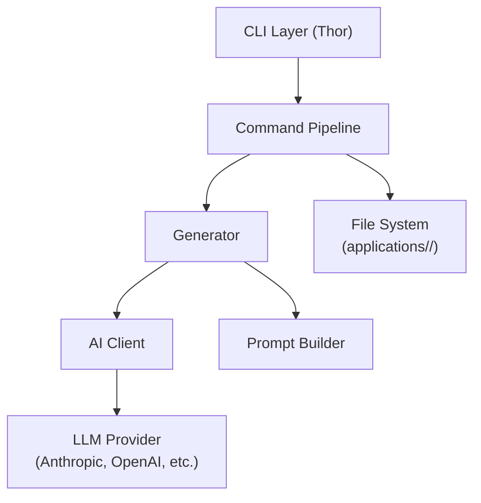

# Architecture Overview

Jojo is a modular Ruby CLI application built around a command pipeline pattern.

## High-level architecture



## Command pipeline pattern

Each command follows a consistent three-part structure:

| Component | Role | Example |
|-----------|------|---------|
| **Command** (`command.rb`) | Orchestration — validates inputs, manages file I/O, coordinates flow | `lib/jojo/commands/research_command.rb` |
| **Generator** (`generator.rb`) | Content generation — builds context, calls AI, processes response | `lib/jojo/generators/research_generator.rb` |
| **Prompt** (`prompt.rb`) | AI prompts — defines system and user prompts for the AI | `lib/jojo/prompts/research_prompt.rb` |

This separation makes it straightforward to add new commands: create the three files, follow the existing pattern.

## Dual AI model strategy

Jojo uses two AI model configurations for different tasks:

| Model | Used for | Why |
|-------|----------|-----|
| **Reasoning model** | Company research, resume tailoring, cover letter writing | Complex analysis and writing requiring deep understanding |
| **Text generation model** | Job description processing, metadata extraction, annotations | Simpler tasks where speed and cost matter more |

Both models are configurable per provider in `config.yml`.

## Core components

| Component | File | Responsibility |
|-----------|------|----------------|
| CLI Layer | `lib/jojo/cli.rb` | Thor-based command interface |
| Configuration | `lib/jojo/config.rb` | User settings management |
| Application | `lib/jojo/application.rb` | Per-application workspace management |
| AI Client | `lib/jojo/ai_client.rb` | Unified interface to AI services |
| Job Processor | `lib/jojo/job_description_processor.rb` | Fetch from URL or file, convert to markdown |
| Status Logger | `lib/jojo/status_logger.rb` | Track decisions and process flow |

## Directory structure

```
lib/jojo/
├── cli.rb                  # Thor CLI entry point
├── config.rb               # Configuration management
├── application.rb          # Application workspace
├── ai_client.rb            # AI provider interface
├── commands/               # Command orchestration
│   ├── research_command.rb
│   ├── resume_command.rb
│   └── ...
├── generators/             # Content generation
│   ├── research_generator.rb
│   ├── resume_generator.rb
│   └── ...
└── prompts/                # AI prompt definitions
    ├── research_prompt.rb
    ├── resume_prompt.rb
    └── ...
```

## Technology stack

| Technology | Purpose |
|------------|---------|
| Ruby 3.4.5 | Language (modern Ruby with PRISM parser) |
| Thor | Command-line interface framework |
| RubyLLM | Unified Ruby interface for AI services |
| deepsearch-rb | Web search integration (optional) |
| html-to-markdown | Job posting URL conversion |
| dotenv | Environment variable management |
| Minitest | Testing framework |
| SimpleCov | Test coverage |
| Standard Ruby | Code formatting |
