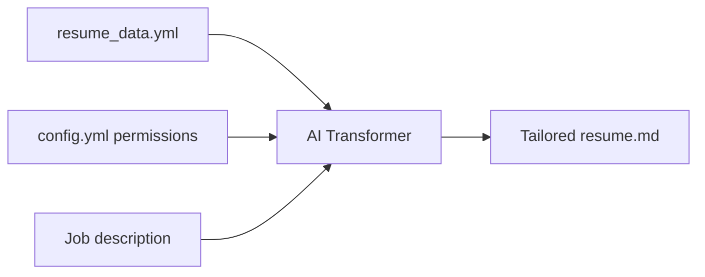

# Customizing Your Resume

Jojo uses a **permissions-based curation** system to tailor your resume for each job. Instead of letting AI freely rewrite your resume, you define exactly what it's allowed to change.

## How it works

Your resume data lives in `inputs/resume_data.yml` as structured YAML. Permissions in `config.yml` control how the AI curates this data for each job opportunity.



## The three permission types

### `remove` — Filter irrelevant items

Allows the AI to remove items from an array field that aren't relevant to the target job.

```yaml
# In config.yml
skills: [remove, reorder]
```

If you have 20 skills and the job focuses on backend development, the AI can remove frontend-specific skills to keep the resume focused.

### `reorder` — Prioritize by relevance

Allows the AI to change the order of items in an array, putting the most job-relevant items first.

```yaml
# In config.yml
experience: [reorder]
```

Your most relevant experience moves to the top, even if it's not the most recent.

### `rewrite` — Adjust wording

Allows the AI to reword text fields to emphasize experience relevant to the target job.

```yaml
# In config.yml
summary: [rewrite]
experience.description: [rewrite]
```

Your professional summary gets rewritten to highlight the skills and experience most relevant to this specific role.

## Permission examples

```yaml
resume_data:
  permissions:
    # Arrays: filter and reorder
    skills: [remove, reorder]
    databases: [remove, reorder]
    tools: [remove, reorder]
    recommendations: [remove]

    # Arrays: reorder only (all items kept)
    experience: [reorder]
    projects: [reorder]
    languages: [reorder]

    # Text: can be rewritten
    summary: [rewrite]
    experience.description: [rewrite]
    education.description: [rewrite]

    # Nested arrays
    experience.technologies: [remove, reorder]
    experience.tags: [remove, reorder]
    projects.skills: [reorder]
```

## Read-only fields

Fields without permissions are **read-only** — the AI passes them through unchanged. This is the right choice for factual data:

- Your name, email, phone, location
- Company names and job titles
- Dates (start/end)
- Education institution names and degrees

## Nested field permissions

Permissions can target nested fields within array items using dot notation:

```yaml
# Each experience entry's description can be rewritten
experience.description: [rewrite]

# Each experience entry's technologies can be filtered
experience.technologies: [remove, reorder]

# Each project's skills can be reordered
projects.skills: [reorder]
```

## Example: before and after

Given a `resume_data.yml` with skills:

```yaml
skills:
  - Ruby
  - Python
  - JavaScript
  - React
  - PostgreSQL
  - Docker
  - Kubernetes
  - AWS
  - CSS
  - HTML
```

For a **backend Ruby position** with `skills: [remove, reorder]`, the AI might produce:

```yaml
skills:
  - Ruby
  - PostgreSQL
  - Docker
  - Kubernetes
  - AWS
  - Python
```

Frontend skills (React, CSS, HTML, JavaScript) were removed, and the remaining skills were reordered by relevance to the role.

## Tips

- **Start conservative** — Use `[reorder]` before adding `[remove]` to see what the AI prioritizes
- **Protect important content** — Don't add permissions to fields you always want included verbatim
- **Use `rewrite` sparingly** — It's powerful but changes your wording; review carefully
- **Test with a real job** — Run `jojo resume` and compare the output against your original data
