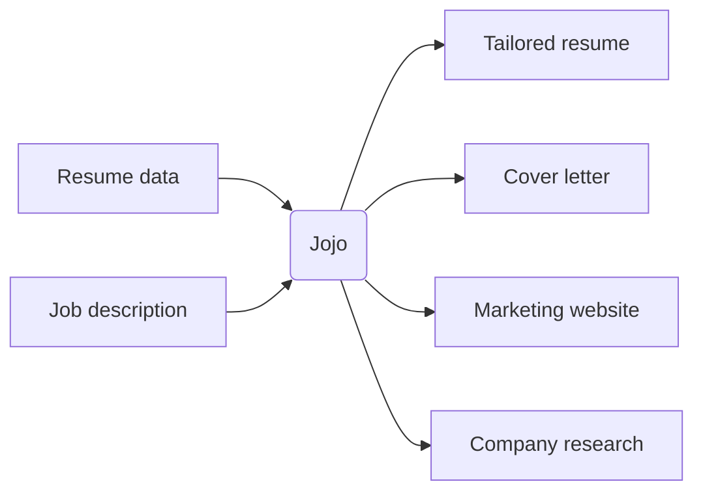

# Jojo

A Ruby CLI that transforms job applications into comprehensive, personalized marketing campaigns.

Instead of sending a generic resume and cover letter, Jojo generates tailored materials for each opportunity: a customized resume, persuasive cover letter, company research, and a professional landing page — all powered by AI.

Think of it as treating each job application like launching a product (you) to a specific customer (the employer).

## What Jojo generates

For each job application, Jojo creates a complete `applications/<slug>/` workspace containing:

| Output | Description |
|--------|-------------|
| **Tailored resume** | Customized from your structured resume data using config-based permissions to filter, reorder, and rewrite fields |
| **Cover letter** | Written using company research, job analysis, and your tailored resume |
| **Company research** | AI-generated insights about the company, industry, and role |
| **Landing page** | Professional website with portfolio, recommendations, annotated job description, and FAQ |
| **Job annotations** | Analysis of how your experience matches each job requirement |
| **FAQ content** | Role-specific questions and answers derived from your background |
| **PDF versions** | Resume and cover letter as PDFs (requires Pandoc) |

## Getting started

New to Jojo? Start with the [installation guide](getting-started/installation) and then follow the [quick start](getting-started/quick-start).

Already set up? Jump to [commands](commands/) or browse the [guides](guides/first-application).
