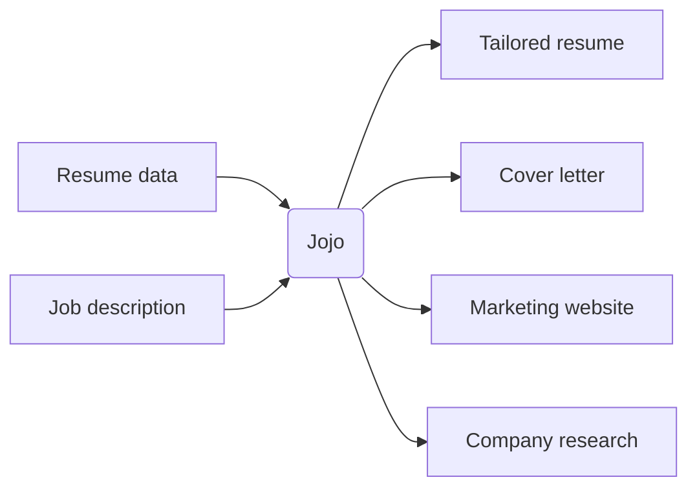

# Documentation Site Implementation Plan

> **For Claude:** REQUIRED SUB-SKILL: Use superpowers:executing-plans to implement this plan task-by-task.

**Goal:** Build a comprehensive Jekyll documentation site for Jojo using flat navigation with just-the-docs, migrating content from the README and creating new pages for commands, guides, architecture, and examples.

**Architecture:** Flat directory structure under `docs/` with parent/child page relationships managed via just-the-docs front matter (`parent`, `nav_order`). Content migrated from README.md and expanded. GitHub Pages deployment via GitHub Actions workflow.

**Tech Stack:** Jekyll 4.4, just-the-docs theme, mermaid diagrams, GitHub Actions for deployment

---

### Task 1: Clean up Jekyll configuration

**Files:**
- Modify: `docs/_config.yml`
- Delete: `docs/_posts/2026-02-09-welcome-to-jekyll.markdown`
- Delete: `docs/about.markdown`
- Modify: `docs/Gemfile`

**Step 1: Update `docs/_config.yml`**

Replace the entire file with:

```yaml
title: Jojo
description: >-
  AI-powered job search tool that transforms applications into
  personalized marketing campaigns.
baseurl: ""
url: ""

theme: just-the-docs
plugins:
  - jekyll-feed

mermaid:
  version: "11.12.2"

aux_links:
  "Jojo on GitHub":
    - "//github.com/grymoire7/jojo"

aux_links_new_tab: true

exclude:
  - plans/
  - examples/
```

**Step 2: Clean up `docs/Gemfile`**

Remove the `minima` gem line (we use just-the-docs, not minima). Remove boilerplate comments. Keep it clean:

```ruby
source "https://rubygems.org"

gem "jekyll", "~> 4.4.1"
gem "just-the-docs"

group :jekyll_plugins do
  gem "jekyll-feed", "~> 0.12"
end
```

**Step 3: Delete boilerplate files**

```bash
rm docs/_posts/2026-02-09-welcome-to-jekyll.markdown
rm docs/about.markdown
```

**Step 4: Update `docs/404.html`**

Replace with Jojo-appropriate content:

```html
---
permalink: /404.html
layout: default
---

<div style="text-align: center; margin: 60px auto; max-width: 600px;">
  <h1>404</h1>
  <p><strong>Page not found</strong></p>
  <p>The page you're looking for doesn't exist. <a href="{{ '/' | relative_url }}">Return to the home page</a>.</p>
</div>
```

**Step 5: Run `bundle install` in docs/ to update Gemfile.lock**

```bash
cd docs && bundle install
```

**Step 6: Build to verify**

```bash
cd docs && bundle exec jekyll build
```

Expected: Clean build with no errors.

**Step 7: Commit**

```bash
git add docs/_config.yml docs/Gemfile docs/Gemfile.lock docs/404.html
git rm docs/_posts/2026-02-09-welcome-to-jekyll.markdown docs/about.markdown
git commit -m "docs: clean up Jekyll boilerplate and update configuration"
```

---

### Task 2: Create home page

**Files:**
- Modify: `docs/index.md` (replace `docs/index.markdown`)

**Step 1: Delete old index and create new `docs/index.md`**

```bash
rm docs/index.markdown
```

Write `docs/index.md` with:

```markdown
---
title: Home
layout: home
nav_order: 1
---

# Jojo

A Ruby CLI that transforms job applications into comprehensive, personalized marketing campaigns.

Instead of sending a generic resume and cover letter, Jojo generates tailored materials for each opportunity: a customized resume, persuasive cover letter, company research, and a professional landing page — all powered by AI.

Think of it as treating each job application like launching a product (you) to a specific customer (the employer).



## What Jojo generates

For each job application, Jojo creates a complete `applications/<slug>/` workspace containing:

| Output | Description |
|--------|-------------|
| **Tailored resume** | Customized from your structured resume data using config-based permissions to filter, reorder, and rewrite fields |
| **Cover letter** | Written using company research, job analysis, and your tailored resume |
| **Company research** | AI-generated insights about the company, industry, and role |
| **Landing page** | Professional website with portfolio, recommendations, annotated job description, and FAQ |
| **Job annotations** | Analysis of how your experience matches each job requirement |
| **FAQ content** | Role-specific questions and answers derived from your background |
| **PDF versions** | Resume and cover letter as PDFs (requires Pandoc) |

## Getting started

New to Jojo? Start with the [installation guide](getting-started/installation) and then follow the [quick start](getting-started/quick-start).

Already set up? Jump to [commands](commands/) or browse the [guides](guides/first-application).
```

**Step 2: Build to verify**

```bash
cd docs && bundle exec jekyll build
```

**Step 3: Commit**

```bash
git rm docs/index.markdown
git add docs/index.md
git commit -m "docs: add home page with project overview and workflow diagram"
```

---

### Task 3: Create Getting Started section

**Files:**
- Create: `docs/getting-started/installation.md`
- Create: `docs/getting-started/configuration.md`
- Create: `docs/getting-started/quick-start.md`

**Step 1: Create `docs/getting-started/installation.md`**

Content to migrate from README sections "Prerequisites", "Installation", and "API Costs". Front matter:

```yaml
---
title: Installation
parent: Getting Started
nav_order: 1
---
```

Include: prerequisites (Ruby 3.4.5, Bundler, AI provider API key, search API key, optional Pandoc), clone & bundle install steps, API cost notes, verification with `./bin/jojo version`.

**Step 2: Create `docs/getting-started/configuration.md`**

Migrate from README "Configuration" section. Front matter:

```yaml
---
title: Configuration
parent: Getting Started
nav_order: 2
---
```

Include: environment variables (.env), user configuration (config.yml) with full annotated example, supported LLM providers list, input files (resume_data.yml, templates, recommendations.md), resume data permissions explanation.

**Step 3: Create `docs/getting-started/quick-start.md`**

Migrate from README "Quick start" section. Front matter:

```yaml
---
title: Quick Start
parent: Getting Started
nav_order: 3
---
```

Include: Step 0 (setup + customize inputs), Step 1 (create workspace with slug guidelines), Step 2 (generate materials), expected output listing.

**Step 4: Build to verify**

```bash
cd docs && bundle exec jekyll build
```

Expected: "Getting Started" appears in nav with three child pages.

**Step 5: Commit**

```bash
git add docs/getting-started/
git commit -m "docs: add Getting Started section (installation, configuration, quick start)"
```

---

### Task 4: Create Commands overview page

**Files:**
- Create: `docs/commands/index.md`
- Delete: `docs/commands.md`

**Step 1: Create `docs/commands/index.md`**

Migrate content from existing `docs/commands.md` and README "Commands" section. Front matter:

```yaml
---
title: Commands
nav_order: 3
has_children: true
---
```

Include: summary table of all commands, global options (`-s`, `-v`, `-q`, `-t`, `--overwrite`, `--no-overwrite`), environment variables (`JOJO_APPLICATION_SLUG`, `JOJO_ALWAYS_OVERWRITE`), overwrite precedence rules, link to each command's detail page.

**Step 2: Delete old `docs/commands.md`**

```bash
rm docs/commands.md
```

**Step 3: Build to verify**

```bash
cd docs && bundle exec jekyll build
```

**Step 4: Commit**

```bash
git rm docs/commands.md
git add docs/commands/index.md
git commit -m "docs: add commands overview page with summary table and global options"
```

---

### Task 5: Create individual command pages (setup, new, generate)

**Files:**
- Create: `docs/commands/setup.md`
- Create: `docs/commands/new.md`
- Create: `docs/commands/generate.md`

Each command page follows a consistent template:

```yaml
---
title: <command name>
parent: Commands
nav_order: <N>
---
```

Sections for each page:
1. One-line description
2. Usage syntax
3. Options (command-specific)
4. Inputs (files read, with descriptions)
5. Outputs (files created, with descriptions)
6. Examples

**Step 1: Create `docs/commands/setup.md` (nav_order: 2)**

- Description: Interactive setup wizard for first-time configuration
- No required options
- Outputs: `.env`, `config.yml`, `inputs/resume_data.yml`, `inputs/templates/default_resume.md.erb`
- Example: show the interactive wizard flow (provider selection, API key, model selection)
- Note about idempotency

**Step 2: Create `docs/commands/new.md` (nav_order: 3)**

- Description: Create application workspace and process job description
- Required: `-s SLUG`, `-j JOB_SOURCE`
- Inputs: job source (file path or URL)
- Outputs: `applications/<slug>/` with `job_description.md`, `job_details.yml`, etc.
- Examples: from file, from URL
- Include slug guidelines from README

**Step 3: Create `docs/commands/generate.md` (nav_order: 4)**

- Description: Run all generation steps in sequence
- Required: `-s` or `JOJO_APPLICATION_SLUG`
- Inputs: all application files + inputs
- Outputs: all generated files (research, resume, cover letter, annotations, faq, website, pdfs)
- Note about step ordering and dependencies

**Step 4: Build to verify**

```bash
cd docs && bundle exec jekyll build
```

**Step 5: Commit**

```bash
git add docs/commands/setup.md docs/commands/new.md docs/commands/generate.md
git commit -m "docs: add command pages for setup, new, and generate"
```

---

### Task 6: Create individual command pages (research, resume, cover-letter, annotate)

**Files:**
- Create: `docs/commands/research.md` (nav_order: 5)
- Create: `docs/commands/resume.md` (nav_order: 6)
- Create: `docs/commands/cover-letter.md` (nav_order: 7)
- Create: `docs/commands/annotate.md` (nav_order: 8)

Follow the same template as Task 5. Source input/output data from the existing `docs/commands.md` table.

**Step 1: Create all four command pages**

- **research**: Generates company/role research. Inputs: job_description.md, job_details.yml. Output: research.md. Note about optional web search integration.
- **resume**: Generates tailored resume. Inputs: job_description.md, job_details.yml, inputs/resume_data.yml. Output: resume.md. Explain permissions-based curation.
- **cover-letter**: Generates cover letter. Inputs: job_description.md, job_details.yml, resume.md, inputs/resume_data.yml. Output: cover_letter.md. Note dependency on resume.
- **annotate**: Generates job description annotations. Inputs: job_description.md, job_details.yml. Output: job_description_annotations.json. Explain tiered matching (strong/moderate/mention).

**Step 2: Build to verify**

```bash
cd docs && bundle exec jekyll build
```

**Step 3: Commit**

```bash
git add docs/commands/research.md docs/commands/resume.md docs/commands/cover-letter.md docs/commands/annotate.md
git commit -m "docs: add command pages for research, resume, cover-letter, and annotate"
```

---

### Task 7: Create individual command pages (branding, faq, website, pdf, interactive)

**Files:**
- Create: `docs/commands/branding.md` (nav_order: 9)
- Create: `docs/commands/faq.md` (nav_order: 10)
- Create: `docs/commands/website.md` (nav_order: 11)
- Create: `docs/commands/pdf.md` (nav_order: 12)
- Create: `docs/commands/interactive.md` (nav_order: 13)

**Step 1: Create all five command pages**

- **branding**: Generates AI branding statement. Inputs: job_description.md, job_details.yml, resume.md, optional research.md. Output: branding_statement.json.
- **faq**: Generates FAQ content. Inputs: job_description.md, job_details.yml, resume.md. Output: faq.json. Explain standard vs custom questions.
- **website**: Generates landing page. Inputs: all previous outputs + templates. Output: website/ directory. Include `-t` template flag. Reference the website templates guide for details.
- **pdf**: Converts MD to PDF. Inputs: resume.md, cover_letter.md. Outputs: resume.pdf, cover_letter.pdf. Note Pandoc requirement and graceful degradation.
- **interactive**: TUI dashboard mode. Default command. Describe keyboard navigation and workflow.

**Step 2: Build to verify**

```bash
cd docs && bundle exec jekyll build
```

**Step 3: Commit**

```bash
git add docs/commands/branding.md docs/commands/faq.md docs/commands/website.md docs/commands/pdf.md docs/commands/interactive.md
git commit -m "docs: add command pages for branding, faq, website, pdf, and interactive"
```

---

### Task 8: Create Guides section

**Files:**
- Create: `docs/guides/first-application.md`
- Create: `docs/guides/customizing-resume.md`
- Create: `docs/guides/website-templates.md`

**Step 1: Create `docs/guides/first-application.md` (nav_order: 1)**

Front matter:
```yaml
---
title: Your First Application
parent: Guides
nav_order: 1
---
```

Narrative walkthrough creating a real application from scratch. Cover:
- Finding a job and saving the description
- Choosing a good slug (with examples)
- Running `new` and examining the workspace
- Running `generate` and reviewing each output
- Deploying the website
- Applying with the generated materials

Migrate and expand the README "Usage" / "Workflow" section into a narrative guide.

**Step 2: Create `docs/guides/customizing-resume.md` (nav_order: 2)**

Front matter:
```yaml
---
title: Customizing Your Resume
parent: Guides
nav_order: 2
---
```

Deep dive into the permissions system:
- How `resume_data.yml` structures your data
- The three permission types: `remove`, `reorder`, `rewrite`
- Field-level control with examples (e.g., `skills: [remove, reorder]` vs `experience: [reorder]`)
- Nested field permissions (e.g., `experience.technologies`, `projects.skills`)
- Read-only fields (no permissions = untouched)
- How AI uses permissions to curate for each job
- Before/after example showing how a resume is tailored

**Step 3: Create `docs/guides/website-templates.md` (nav_order: 3)**

Front matter:
```yaml
---
title: Website Templates
parent: Guides
nav_order: 3
---
```

Migrate and expand README "Custom Templates" section:
- Default template features (masthead, portfolio, recommendations carousel, annotated job description, FAQ accordion, CTA)
- Using `-t` flag to select templates
- Creating custom templates (copy default, edit, reference)
- Available template variables (full list with descriptions)
- Template file structure and ERB syntax basics

**Step 4: Build to verify**

```bash
cd docs && bundle exec jekyll build
```

**Step 5: Commit**

```bash
git add docs/guides/
git commit -m "docs: add guides for first application, resume customization, and website templates"
```

---

### Task 9: Create Architecture section

**Files:**
- Create: `docs/architecture/overview.md`
- Create: `docs/architecture/key-decisions.md`

**Step 1: Create `docs/architecture/overview.md` (nav_order: 1)**

Front matter:
```yaml
---
title: Overview
parent: Architecture
nav_order: 1
---
```

Content:
- High-level system architecture with mermaid diagram showing: CLI layer → Command pipeline → AI Client → Provider
- Command pipeline pattern: each command has `command.rb` (orchestration), `generator.rb` (content generation), `prompt.rb` (AI prompts)
- Dual AI model strategy: reasoning model for complex tasks vs text generation model for speed
- Directory structure overview (lib/jojo/ organization)
- Technology stack summary table

**Step 2: Create `docs/architecture/key-decisions.md` (nav_order: 2)**

Front matter:
```yaml
---
title: Key Decisions
parent: Architecture
nav_order: 2
---
```

Content (each decision as a section with "Decision", "Alternatives considered", "Rationale"):
- **Permission-based resume curation** - Why not let AI freely rewrite? Granular control, data integrity, predictable results
- **Dual AI models** - Reasoning model for complex analysis, text generation for speed and cost. Configurable per provider.
- **Command pipeline pattern** - Consistent command/generator/prompt structure for all commands. Easy to add new commands.
- **Status logging** - JSON Lines audit trail for debugging, cost tracking, and process verification
- **Web search integration** - Optional with graceful degradation. Multiple provider support.
- **Template system** - ERB templates for maximum flexibility. Self-contained HTML for portability.

**Step 3: Build to verify**

```bash
cd docs && bundle exec jekyll build
```

**Step 4: Commit**

```bash
git add docs/architecture/
git commit -m "docs: add architecture overview and key technical decisions"
```

---

### Task 10: Create Examples section

**Files:**
- Create: `docs/examples/configuration.md`
- Create: `docs/examples/resume-data.md`

**Step 1: Create `docs/examples/configuration.md` (nav_order: 1)**

Front matter:
```yaml
---
title: Configuration
parent: Examples
nav_order: 1
---
```

Annotated `config.yml` example with detailed explanations of each section. Migrate from `docs/examples/config_permissions_example.yml` and expand with:
- Full config.yml structure with every option explained
- Permissions section with commentary on each field
- Provider-specific notes

**Step 2: Create `docs/examples/resume-data.md` (nav_order: 2)**

Front matter:
```yaml
---
title: Resume Data
parent: Examples
nav_order: 2
---
```

Annotated `resume_data.yml` example. Migrate from `docs/examples/resume_data_example.yml` and expand with:
- Full schema with every field explained
- Which fields are required vs optional
- How permissions interact with each field type
- Tips for writing effective content

**Step 3: Build to verify**

```bash
cd docs && bundle exec jekyll build
```

**Step 4: Commit**

```bash
git add docs/examples/configuration.md docs/examples/resume-data.md
git commit -m "docs: add annotated configuration and resume data examples"
```

---

### Task 11: Add GitHub Pages workflow

**Files:**
- Create: `.github/workflows/pages.yml`

**Step 1: Create `.github/workflows/pages.yml`**

```yaml
name: Deploy docs to GitHub Pages

on:
  push:
    branches: ["main"]
    paths:
      - "docs/**"
      - ".github/workflows/pages.yml"
  workflow_dispatch:

permissions:
  contents: read
  pages: write
  id-token: write

concurrency:
  group: "pages"
  cancel-in-progress: false

jobs:
  build:
    runs-on: ubuntu-latest
    steps:
      - name: Checkout
        uses: actions/checkout@v4

      - name: Setup Ruby
        uses: ruby/setup-ruby@v1
        with:
          ruby-version: '3.4'
          bundler-cache: true
          working-directory: docs

      - name: Setup Pages
        uses: actions/configure-pages@v5

      - name: Build with Jekyll
        run: bundle exec jekyll build --baseurl "${{ steps.pages.outputs.base_path }}"
        working-directory: docs
        env:
          JEKYLL_ENV: production

      - name: Upload artifact
        uses: actions/upload-pages-artifact@v3
        with:
          path: docs/_site

  deploy:
    environment:
      name: github-pages
      url: ${{ steps.deployment.outputs.page_url }}
    runs-on: ubuntu-latest
    needs: build
    steps:
      - name: Deploy to GitHub Pages
        id: deployment
        uses: actions/deploy-pages@v4
```

**Step 2: Commit**

```bash
git add .github/workflows/pages.yml
git commit -m "ci: add GitHub Pages deployment workflow for docs"
```

---

### Task 12: Slim down README.md

**Files:**
- Modify: `README.md`

**Step 1: Rewrite README.md**

Replace the current comprehensive README with a concise landing page:

- Project name and badges (keep existing badges)
- One-paragraph description of what Jojo does
- Mermaid workflow diagram (keep)
- Link to blog post (keep)
- "Documentation" section with link to the docs site
- Quick install snippet (3 lines: clone, bundle, setup)
- Brief "Development" section (how to run tests, link to docs for more)
- Contributing (keep brief, link to docs)
- Credits and license (keep)

Target: ~100-150 lines (down from ~715).

**Step 2: Build docs to verify no broken links**

```bash
cd docs && bundle exec jekyll build
```

**Step 3: Commit**

```bash
git add README.md
git commit -m "docs: slim README to project overview with links to documentation site"
```

---

### Task 13: Final verification

**Step 1: Full Jekyll build**

```bash
cd docs && bundle exec jekyll build
```

Expected: Clean build, no errors, no warnings.

**Step 2: Local preview**

```bash
cd docs && bundle exec jekyll serve
```

Manually verify in browser:
- Home page renders with mermaid diagram
- Navigation shows all sections with children
- All links between pages work
- Command pages all follow consistent format
- 404 page works

**Step 3: Run project tests to ensure nothing broke**

```bash
./bin/test
```

Expected: All tests pass.

**Step 4: Final commit if any fixes needed**

```bash
git add -A && git commit -m "docs: fix any issues found during final verification"
```
